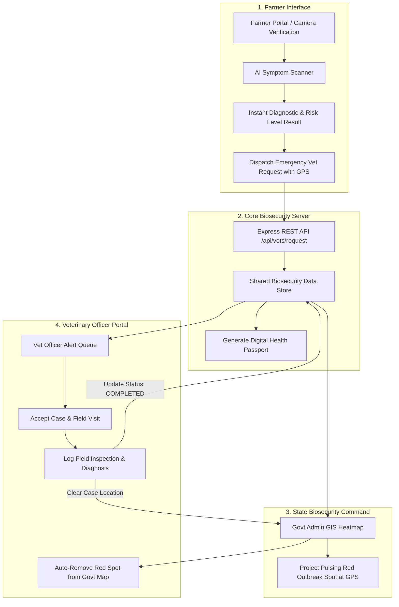

# Pashu Rakshak — AI-Powered Farm Biosecurity & Disease Detection Platform

> **Comprehensive Livestock Health Management, Early Outbreak Prevention & Real-Time GIS Surveillance Engine**  
> *Built for Prasunethon 2.0 Hackathon 2026*

---

##  Problem Statement

Livestock farming supports over 20.5 million livelihoods in rural India, contributing significantly to agricultural GDP. However, smallholder farmers face severe challenges due to delayed disease identification, limited access to qualified Veterinary Officers in remote villages, and unchecked contagion spread (such as Lumpy Skin Disease and Foot & Mouth Disease). 

Traditional reporting relies on manual record-keeping and delayed official notifications, leading to catastrophic livestock mortality and economic loss. **Pashu Rakshak** solves this problem by providing an offline-first, AI-driven diagnostic scanner, automated proximity-based Vet Officer dispatch, immutable digital health passports, and real-time GIS epidemiological tracking for government biosecurity officials.

---

## ✨ Key Features

- ** Animal-Specific AI Disease Detection:** Multi-species diagnostic engine tailored for Cattle, Buffalo, Swine, and Poultry with two-stage symptom risk analysis.
- **Offline-First Architecture:** Local caching and instant offline assessment allowing farmers to diagnose symptoms even in zero-connectivity rural zones.
- ** Automated Vet Connect:** Proximity-based Veterinary Officer locator using Haversine GPS distance calculation, instant emergency request dispatching, and call routing.
- ** Digital Health Passports:** Immutable animal health cards tracking vaccination history, diagnostic logs, and verified veterinary visit records.
- ** Dynamic GIS Outbreak Heatmap:** Real-time containment radius visualization on government dashboards that automatically projects active un-inspected cases as **Red Spots** and auto-clears them once a Vet Officer logs field inspection & diagnosis.
- ** Emergency Geo-Alert Broadcast:** Command center tool enabling government administrators to issue regional quarantine alerts and boundary restrictions to registered farmers.
- ** Multilingual & Voice Support:** Full English and Hindi interface with audio narration for accessible, low-literacy farmer onboarding.
- ** Govt Admin Audit & Duty Scorecard:** Performance metrics, response time tracking, and grievance resolution dashboard for state veterinary departments.

---

##  Tech Stack

| Domain | Technologies & Libraries Used |
| :--- | :--- |
| **Frontend** | React 18, Vite, Vanilla CSS + TailwindCSS, Lucide Icons, Leaflet / React-Leaflet |
| **Backend** | Node.js, Express.js, RESTful API Architecture, Serverless-Friendly Persistent Store & LocalStorage Dual-Sync Engine |
| **AI / Diagnostic Logic** | Multi-Stage Rule-Based Epidemiological Inference Engine & Clinical Symptom Matching |
| **Gis & Mapping** | OpenStreetMap, Leaflet GIS, Haversine Proximity Calculation |
| **Audio & Media** | ElevenLabs AI Voice Narrations, HTML5 Video & Audio Media Players |

---

## Architecture Overview

The following Mermaid diagram outlines the end-to-end data flow across Farmer, Vet Officer, and Government Admin workflows:



---

##  Screenshots

> *Screenshots demonstrating the core user flows of Pashu Rakshak:*

| View | Screenshot Description |
| :--- | :--- |
| **Hero Landing** | `` |
| **Farmer AI Scanner** | `` |
| **Vet Officer Portal** | `` |
| **Govt GIS Command** | `` |

---

##  How It Works

1. **Two-Stage AI Diagnostic Flow:**
   - **Stage 1 (Species & Visual Check):** The farmer selects the affected animal type (Cattle, Swine, Poultry) and performs face/symptom verification.
   - **Stage 2 (Symptom Matching & Risk Indexing):** The engine matches reported symptoms (nodules, fever, drooling, lesion placement) against the biosecurity database, returning an instant Risk Index (`HIGH`, `CRITICAL`, `MODERATE`) and clinical guidelines.

2. **Automated Red Spot Outbreak Tracking:**
   - When a farmer dispatches an emergency request with GPS coordinates, a **Red Spot Outbreak Marker** immediately appears on the **State Biosecurity GIS Command Map**.
   - The Red Spot remains active on the map until a certified Veterinary Officer conducts a field visit and submits **Log Field Inspection & Diagnosis**.
   - Upon logging the inspection, the backend clears the case status to `COMPLETED`, and the Red Spot is **automatically removed** from the government dashboard map.

---

##  Installation & Setup

Follow these steps to set up and run **Pashu Rakshak** locally:

### 1. Clone the Repository
```bash
git clone https://github.com/aryangoswami/pashu-rakshak.git
cd pashu-rakshak
```

### 2. Install Dependencies
Run the unified setup script to install dependencies for root, backend, and frontend:
```bash
npm run setup
```
*Alternatively, install manually:*
```bash
# Root dependencies
npm install

# Backend dependencies
cd backend && npm install

# Frontend dependencies
cd ../frontend && npm install
```

### 3. Environment Configuration
Create `.env` files using the provided `.env.example` templates:

**Backend (`backend/.env`):**
```env
PORT=5000
NODE_ENV=development
```

**Frontend (`frontend/.env`):**
```env
VITE_API_BASE_URL=http://localhost:5000
```

### 4. Run the Project Locally
Start both backend and frontend servers:

```bash
# Terminal 1: Start Backend Server (Port 5000)
npm run dev:backend

# Terminal 2: Start Frontend Dev Server (Port 5173)
npm run dev:frontend
```

Open your browser and navigate to **`http://localhost:5173`**.

---

##  Live Links

- **Deployed Platform URL:** `https://pashu-rakshak.vercel.app` *(Placeholder)*
- **Demo Video Walkthrough:** `https://youtube.com/watch?v=demo-placeholder` *(Placeholder)*

---

##  Team & Contributors

- **Aryan Goswami** — *Lead Developer & Architect*
- **Pashu Rakshak Team** — *Biosecurity Research & UI/UX Design*

---

##  License

This project is open-source and available under the [MIT License](LICENSE).
good to go
---
good
##  Acknowledgements

- Built for **Prasunethon 2.0 Hackathon 2026**
- Special thanks to open-source communities behind React, Leaflet, OpenStreetMap, TailwindCSS, and Express.js.
